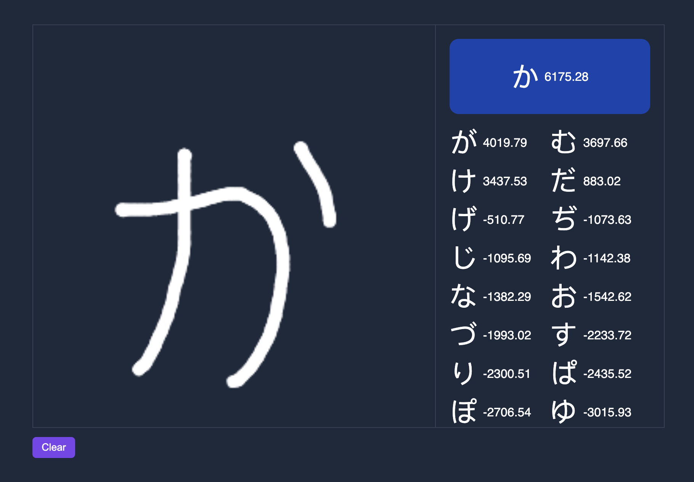

# Hiragana Prediction

Tensorflow project for predicting hiragana characters.

---

The model is trained from fonts (WIP), these are saved into image maps through `make scrape`. Found out about the `MNIST` dataset after building this 🙃.

`make train` - Train the model based on scraped fonts

`make api` - Start a flask server that runs predictions

`make client` - Start the canvas application

